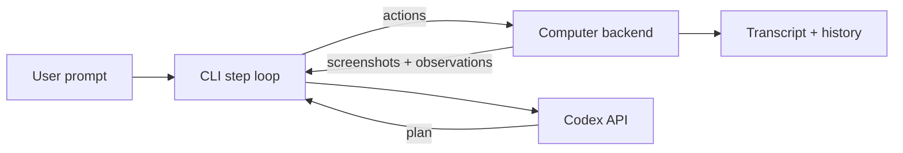

<div align="center">

# Windexter

_Polished CLI + toolkit for driving the OpenAI Computer-Using Agent sample with Playwright, Codex, and plug-in computers._

[](#install--first-run)
[](#requirements)
[](#requirements)
[](https://github.com/BranchManager69/windexter/releases)
[](#license)

</div>

---

## Quick Navigation
- [Why Windexter](#why-windexter)
- [Requirements](#requirements)
- [Install & First Run](#install--first-run)
- [How It Works](#how-it-works)
- [Workflows](#workflows)
- [Configuration Cheat Sheet](#configuration-cheat-sheet)
- [Extending Computers](#extending-computers)
- [Troubleshooting & FAQ](#troubleshooting--faq)
- [Contributing](#contributing)
- [Roadmap](#roadmap)
- [License](#license)

## Why Windexter
Windexter turns the OpenAI Computer-Using Agent reference project into a production-ready CLI. You get:
- **Guided agent loop** – step-by-step confirmation prompts keep Codex on-task and let you redirect at any time.
- **Multiple computer targets** – Playwright local, Dockerized desktops, Browserbase, Scrapybara, and your own backends.
- **Extensible interface** – define new `Computer` subclasses or tools to expose filesystem, shell, or MCP actions.
- **Codextendo-ready history** – transcripts integrate cleanly with Codextendo for session recall and summaries.
- **Docs + examples** – `docs/quickstart.md` and `examples/` walk through end-to-end setup on macOS, Linux, and WSL.

## Requirements
- macOS 12+, Ubuntu 20.04+/Debian 10+, or Windows 11 via WSL2.
- Python 3.10 or newer with `venv`.
- Playwright browser binaries (`python -m playwright install`) and, on Linux, `playwright install-deps`.
- Optional: Docker Desktop (for `docker` computer), Browserbase/Scrapybara credentials for hosted computers.
- `OPENAI_API_KEY` exported for Codex access.

## Install & First Run
1. **Clone and create a virtualenv**
   ```bash
   git clone https://github.com/BranchManager69/windexter.git
   cd windexter
   python3 -m venv .venv
   source .venv/bin/activate
   pip install -r requirements.txt
   ```

2. **Install Playwright assets**
   ```bash
   python -m playwright install
   # Ubuntu/Debian only
   sudo ./.venv/bin/playwright install-deps
   ```

3. **Run the CLI**
   ```bash
   python cli.py --computer local-playwright
   ```

4. **Fire off a prompt immediately**
   ```bash
   python cli.py --computer local-playwright --input "open bing and search for weather"
   ```

Need more hand-holding? Follow the terminal-by-terminal walkthrough in [docs/quickstart.md](docs/quickstart.md).

## How It Works


- The CLI orchestrates a confirmation loop (`>` prompt) between you, Codex, and the chosen computer backend.
- Computers emit observations, screenshots, and tool outputs; Windexter summarizes and presents them for confirmation.
- Sessions can be seeded with a first prompt (`--input`) or run interactively.

## Workflows
### 1. Interactive browser automation
- Run `python cli.py --computer local-playwright`.
- At each `>` prompt, confirm or override Codex’s next action.
- Use `--show` to display screenshots inline and `--debug` to print raw tool outputs.

### 2. One-shot directive
- `python cli.py --computer local-playwright --input "open bing and search for weather"`
- Windexter handles the first turn automatically, then drops you back at the prompt for follow-up.

### 3. Swap computers
- Edit `computers/config.py` to set a different default (`docker-desktop`, `browserbase`, etc.).
- Pass `--computer <name>` on the CLI to override per session.

### 4. Record transcripts
- Run under Codextendo or your own logging to capture `steps.jsonl` for later analysis and replay.

## Configuration Cheat Sheet
| Option | Default | Purpose | Change when |
| --- | --- | --- | --- |
| `--computer <name>` | `local-playwright` | Selects computer backend | Targeting Docker, Browserbase, or custom computer |
| `--input "..."` | empty | Seeds first turn | Kick off with an opening directive |
| `--start-url` | `about:blank` | Initial browser URL | Jump directly to a site |
| `--debug` | off | Prints raw messages | Need full JSON for debugging |
| `--show` | off | Opens screenshots locally | Want visual confirmation |
| `OPENAI_API_KEY` | unset | Codex auth | Use different API key per session |

## Extending Computers
1. Create a subclass under `computers/contrib/` (see `computers/computer.py` for the interface).
2. Register it in `computers/contrib/__init__.py` and `computers/config.py` with a human-friendly name.
3. Document usage in `README.md` and `docs/`.
4. Optionally add example scripts in `examples/` and tests in `tests/`.

## Troubleshooting & FAQ
- **Playwright fails to launch** – rerun `python -m playwright install`; on Linux: `sudo ./.venv/bin/playwright install-deps`.
- **401 Invalid API key** – export `OPENAI_API_KEY` in the shell running Windexter.
- **Agent stops at `>` prompt** – type `continue`, provide new instructions, or set an auto-continue flag in `cli.py`.
- **Screenshots not showing** – pass `--show` or inspect the generated files under `./agent/session_*`.

## Contributing
Issues and pull requests welcome. Start with the [Roadmap](#roadmap) or propose new computers, tooling hooks, or tutorial content.

## Roadmap
- Auto-continue / unattended mode for long workflows.
- GPT-5 sidecar to brainstorm follow-up actions.
- Richer computer actions (filesystem, shell, MCP integrations).
- Tutorial videos and annotated screenshots.

## License
MIT. See [LICENSE](LICENSE) for details.
